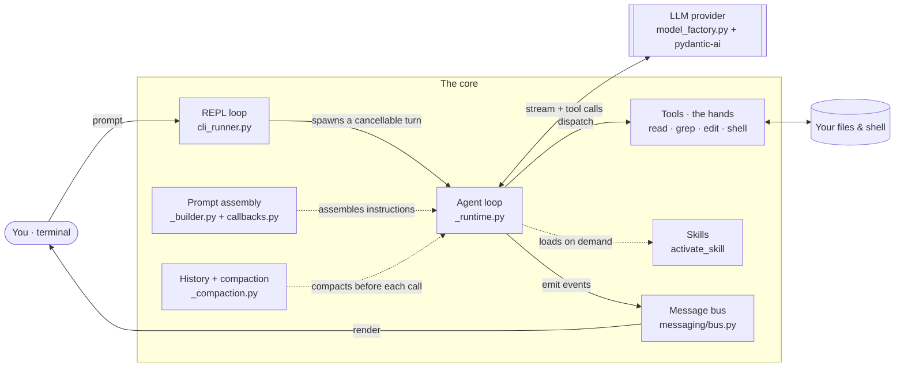
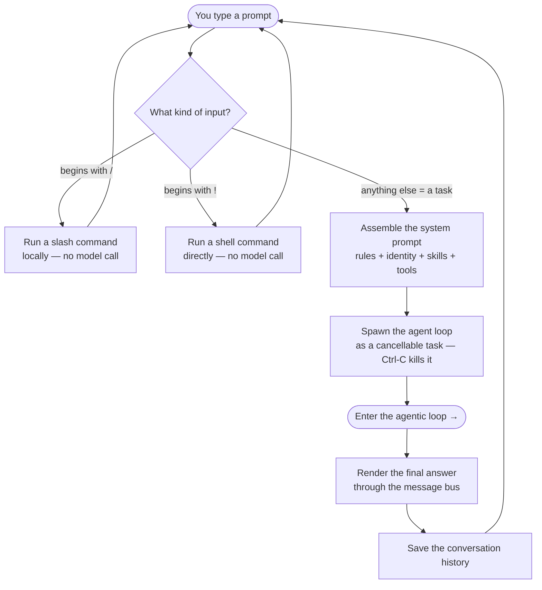
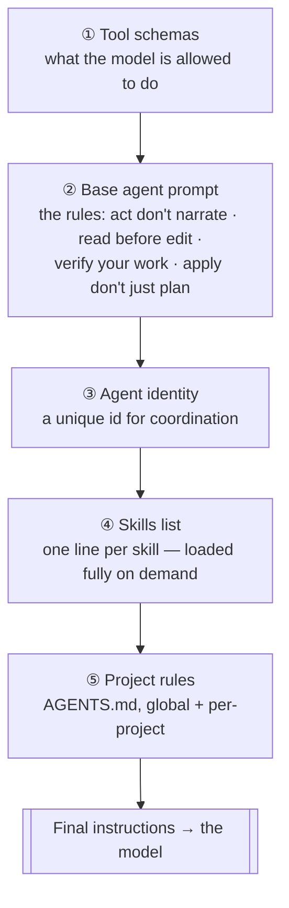
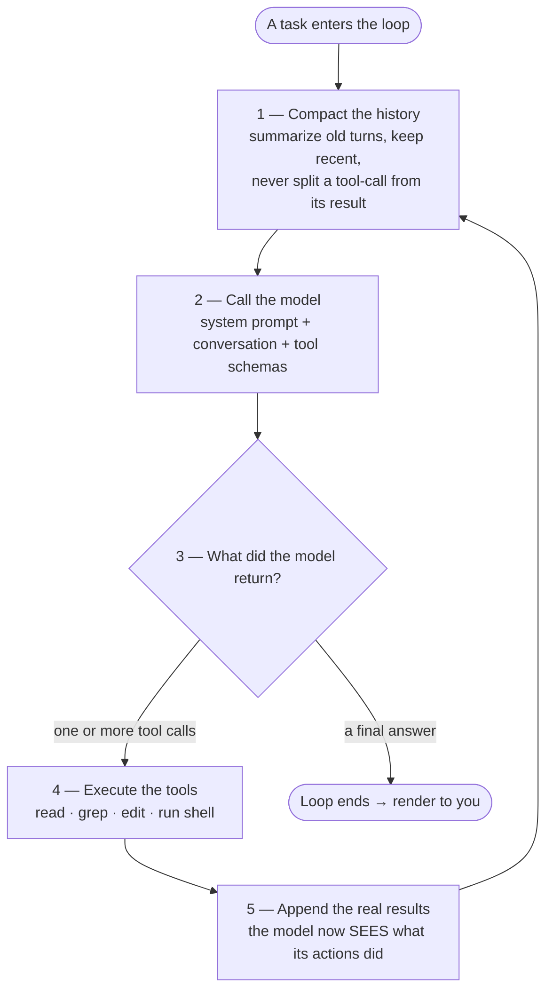
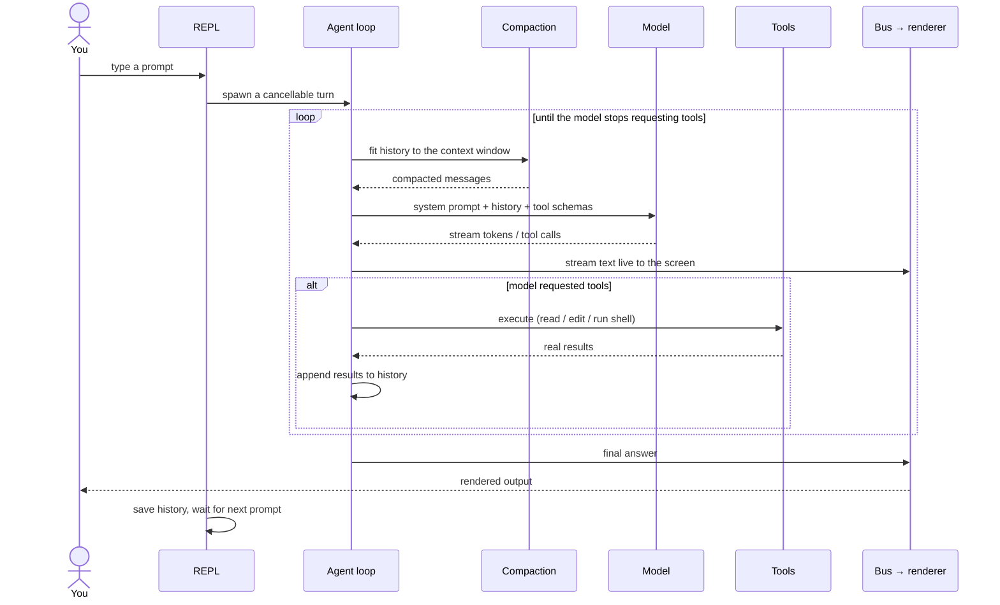

# How the Core Works

This document explains the brain of the agent: what happens the moment you type a prompt, how the request is handled, how the agentic loop turns a language model into something that can actually *do* things, and why the result feels intelligent.

> **The honest one-liner:** the core itself isn't "smart" — it's a well-designed body wrapped around a borrowed brain (the LLM). The intelligence *emerges* from a tight loop that lets the model act, see real results, and correct itself. Everything below is that loop and the scaffolding around it.

---

## TL;DR

When you send a prompt, the agent doesn't answer in one shot. It enters a loop: it calls the model, the model asks to run a tool (read a file, grep, edit, run a shell command), the tool runs against **your real files and shell**, the result is fed back, and the model is called again — over and over until it has actually solved and verified the task. That act → observe → re-decide cycle, grounded in real tool output, is the whole trick.

---

## Architecture at a glance

| Piece | Lives in | Job |
|---|---|---|
| **REPL loop** | `cli_runner.py` | Reads your input, decides what kind of input it is, spawns a turn, renders, repeats. |
| **Agent loop** | `_runtime.py` | Runs one turn: model → tools → results → model, until done. Wraps the loop with retries and clean cancellation. |
| **Prompt assembly** | `_builder.py`, `callbacks.py` | Builds the system prompt fresh each run from layered fragments. |
| **History + compaction** | `_compaction.py`, `_history.py` | Keeps the conversation inside the context window without losing the thread. |
| **Tools** | `tools/` | The hands: read, list, grep, edit files, run shell commands. |
| **Skills** | `plugins/agent_skills/` | Specialized instructions loaded **on demand**, not crammed into every prompt. |
| **Message bus** | `messaging/` | Decouples logic from rendering — enables live streaming and spinners. |
| **Model layer** | `model_factory.py` | Talks to the LLM provider (streaming, tool calls, caching). |

---

## What happens when a prompt lands

Step by step:

1. **The REPL reads your input.** A simple read-loop waits for a line.
2. **It decides what the input is.** Three paths: a line starting with `/` is a **slash command** (handled locally, no model), a line starting with `!` is a **raw shell command** (run directly, no model), and anything else is a **task** for the agent. Only tasks reach the model — this keeps cheap operations cheap.
3. **The system prompt is assembled.** For a task, the agent's instructions are built fresh (see the next section). This is what turns a generic model into a disciplined coding agent.
4. **The turn is spawned as a cancellable task.** The whole turn runs in isolation, so pressing **Ctrl-C** cleanly stops it — the model call, any running tools, everything — without corrupting the session.
5. **The agentic loop runs** (the heart — next-next section).
6. **The answer is rendered and history is saved**, and control returns to the REPL for your next prompt.

---

## The system prompt: assembled, not hardcoded

There is no single fixed prompt string. The instructions are **rebuilt on every run** by stacking layers, in an order chosen so the stable part can be cached cheaply:

- **Tool schemas** tell the model exactly which tools exist and how to call them.
- **The base prompt** carries the rules that make behavior reliable — *use a tool instead of describing, read a file before editing it, verify your work by running it, and actually apply edits rather than just planning them.* These specific lines exist to prevent specific failure modes (a capable model will otherwise happily *describe* a fix and stop).
- **Identity** gives the agent a stable handle, useful when multiple agents coordinate.
- **The skills list** names available skills one line each; the model pulls a skill's full instructions only when it needs them (this is *progressive disclosure* — tiny prompt, unbounded capability).
- **Project rules** (`AGENTS.md`) layer in your repo's conventions.

Fragments are contributed through a small **hook bus** (`callbacks.py`), so features can add to the prompt without the core knowing about them — while the assembly order stays fixed and legible.

---

## The agentic loop

This is the engine. One trip around it is one model call plus whatever it triggers.

1. **Compact the history.** Before each model call, the conversation is trimmed to fit the context window — older turns are summarized while the system prompt and the most recent turns are protected, and crucially a tool call is **never** separated from its result (which would corrupt the conversation). This is the agent's working memory.
2. **Call the model.** It receives the system prompt, the (compacted) conversation so far, and the tool schemas. It sees everything that has happened this turn, including the output of every tool it has already run.
3. **The model responds** with one of two things: a set of **tool calls** ("read this file", "run these tests", "replace these lines"), or a **final answer** with no tool calls.
4. **If it asked for tools, they run** — against your real filesystem and shell — and their output (file contents, command output, error messages) is captured.
5. **The results are appended to the history**, and the loop returns to step 1. The model now gets to *see what its actions actually produced* and decide what to do next.

A single task might take **1 trip** around this loop or **15**: read a file, notice it imports something, grep for that, run the tests, see a failure, fix a line, re-run — looping until satisfied, then answering.

---

## A full turn, end to end

---

## Why it's intelligent

The model is the brain, but a raw model gets one shot — it predicts an answer from the prompt and stops. The core changes its nature. Five things do the work:

1. **The loop is the biggest factor.** Wrapping the model in *act → observe → re-decide* lets it gather evidence, test a hypothesis, see it fail, and correct — instead of guessing once. Most of the "intelligence" you perceive is really **iteration plus the ability to check its own work**.
2. **Tools ground it in reality.** Because it reads the actual files and runs the actual commands, it isn't hallucinating about your codebase — it's observing it. The gap between *"I think this function does X"* and *"I read it; it does X"* is the gap between a chatbot and an agent.
3. **Feedback closes the loop.** Tool output re-enters the conversation, so the next model call reasons over a real stack trace or a real test result, not over its own assumptions.
4. **Prompt discipline turns capability into reliability.** The rules baked into the system prompt (use tools, read before editing, verify, apply don't just plan) are what stop a capable model from being a sloppy one.
5. **Memory and skills handle scale.** Compaction keeps long tasks coherent without overflowing the context window, and progressive-disclosure skills let it pull in specialized expertise only when a task needs it.

Strip all of that away and you have a text predictor. Add it back and you have something that can drive a real coding session — which is exactly what this core is.
